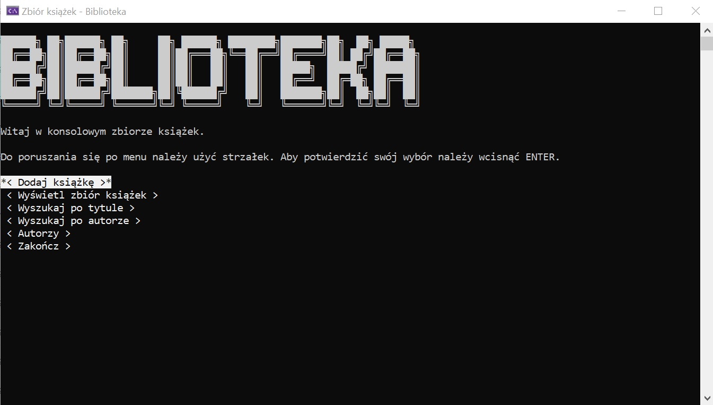
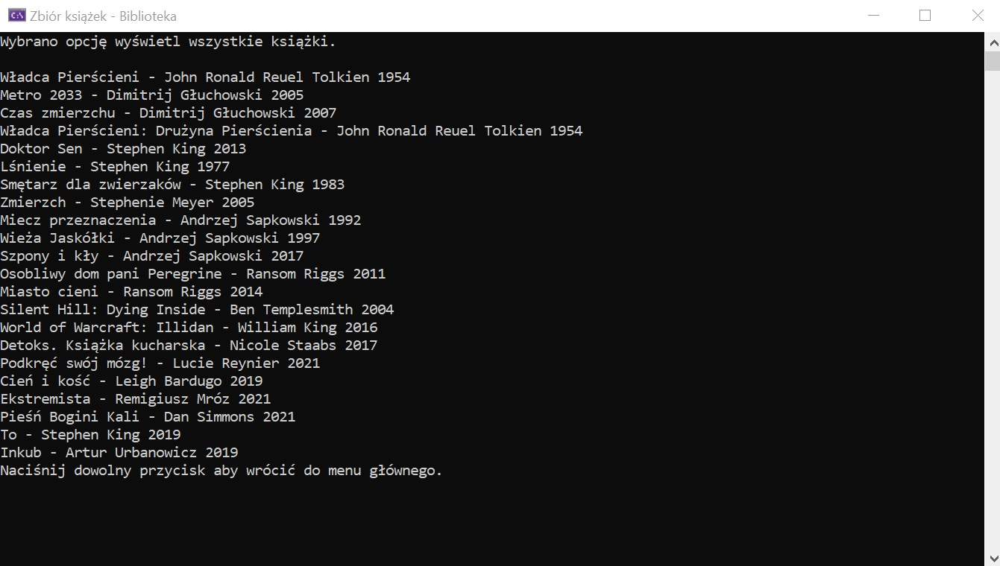
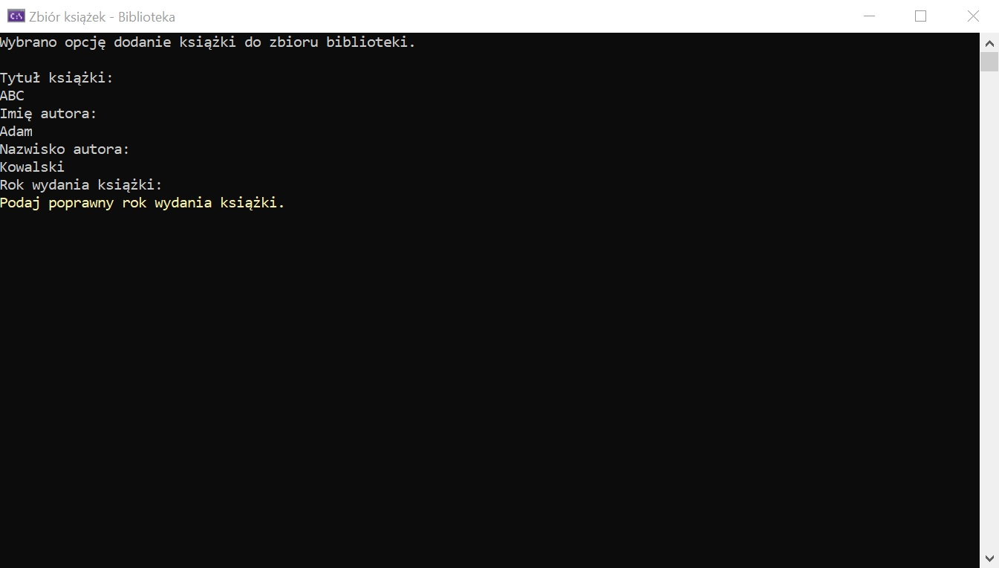
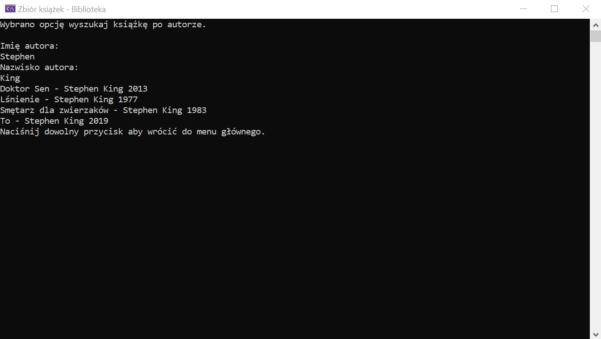
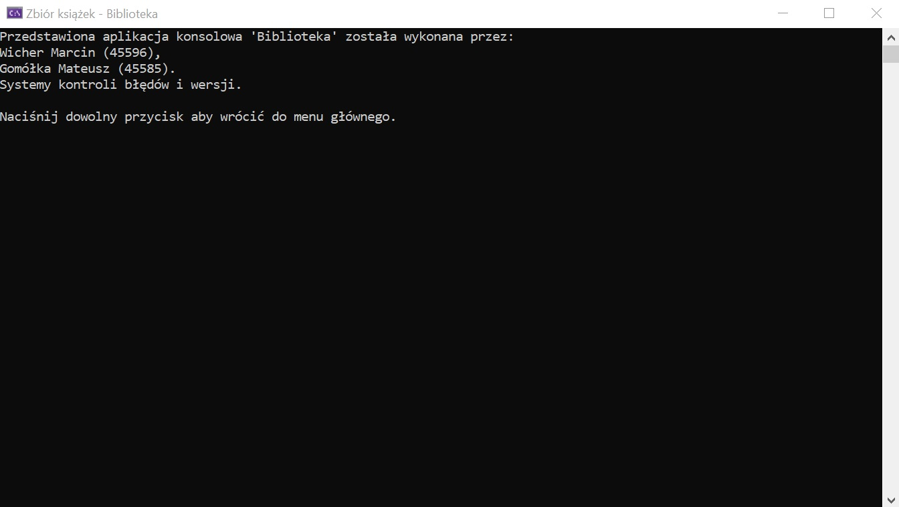
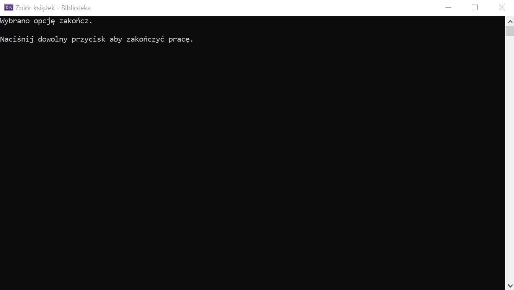

# Library
## Zawartość dokumentacji
* Autorzy projektu
* Główne informacje
* Jak działa?
* Dodatkowe inforamcje
* Zdjęcia

## Autorzy projektu
Mateusz Gomółka

Marcin Wicher

## Główne informacje

Głównym celem tej aplikacji konsolowej jest zasymulowanie funkcjonalności systemu bibliotecznego, w którym można dodawać nowe książki do zbioru, a także przeszukiwać zbiór na trzy sposoby: wypisywanie całego zbioru lub poprzez wpisanie tytułu książki albo imienia oraz nazwiska autora.
	
## Jak działa?

Po włączeniu aplikacji użytkownik zostaje przekierowany do głównego menu biblioteki, z którego można dokonać dodania książki, wyszukania jej, a także odwiedzić stronę poświęconej twórcom oraz zamknąć aplikację z poziomu konsoli. W menu należy poruszać się za pomocą strzałek (góra, dół), a interesującą użytkownika opcję potwierdzić wciskająć "ENTER".

## Dodatkowe informacje

Aplikacja podczas próby dodawania książki wymusza na użytkowniku wprowadzenia wszystkich kompletnych i poprawnych danych. W przypadku błędnych danych próba dodania do zbioru nie kończy się, do momentu aż użytkownik podane poprawne dane. Niezależnie od tego, czy podczas wyszukiwania zostaną użyte małe lub wielkie litery, nie wpływa to na efekt wyszukiwania.

## Zdjęcia

